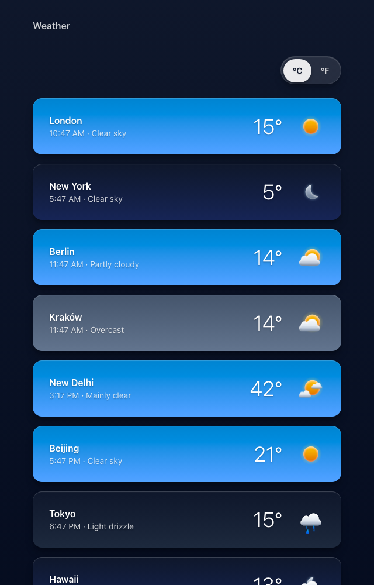

# Weather App

A small weather app built with Next.js.

This project was created as part of the [Design with Code](https://www.designwithcode.dev/) course.

## Screenshot



## Getting Started

```bash
npm install
npm run dev
```
